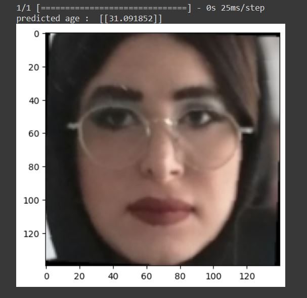
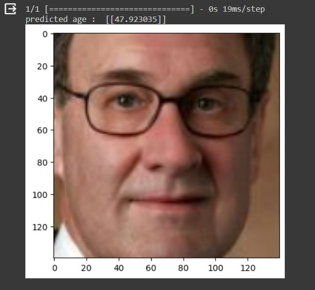
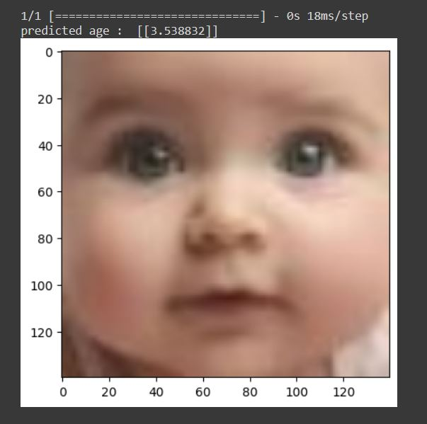
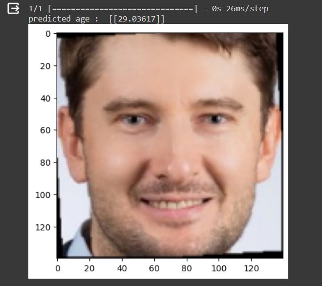
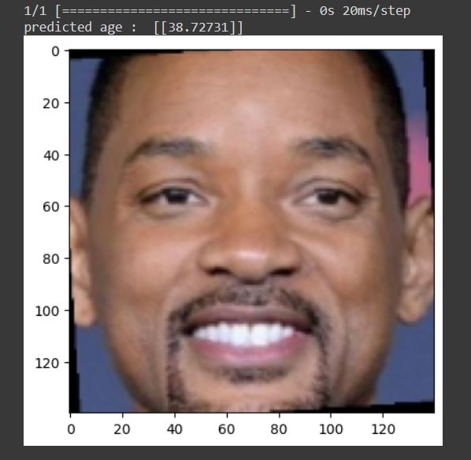

# Age Prediction 👶🏻🧒🏻👨🏻👵🏻


<br/> 

# Description :

<br/>

> ## 1_CNN Regression : <br/>
> In this project , we want to predict people's age .
Despite of previous projects which we used classification method using CNN , Now we are going to have one output which is an age . 
so here we have to use `Regression` method . 

> ## 2_ Kaggle to Colab : <br/>
> Here , we want to use a Kaggle Dataset named `UTKFace` .
Now we can access dataset through kaggle , without downloading it directly :
frist of all we have to create New API Token , It will download `kaggle.json` file on your google colab .
here is the instruction : <br/>

1_ making a directory named Kaggle : <br/>
```
!mkdir ~/.kaggle 
```
2_ then copy kaggle.json file into that : <br/>
```
!cp kaggle.json ~/.kaggle/ 
```
3_ using below command our dataset will be download : <br/>
```
!kaggle datasets download -d jangedoo/utkface-new 
```
4_ now we need to unzip and use it : <br/>
```
!unzip -qq utkface-new.zip 
```
<br/> 
-------------------------------------------------------------------------------------------------------------------------

> ## 3_  Using wandb :
> wandb or Weights & Biases, is a machine learning platform that allows you to track & visualize different aspects of the model training process in real-time. <br/>
here is the project wandb link : <br/>
https://wandb.ai/kianajahanshid/Age_prediction_UTKFace?workspace=user-kianajahanshid

<br/>
<br/>

# How to install
Run this command to install used libraries : 
```
pip install -r requirements.txt 
```
<br/>
<br/>

# How to run 
you can run `Age_predictor_UTKFaceDataset.ipynb` file and train model ,
or else you can load_model with .keras file which is in below google drive link : <br/>

https://drive.google.com/file/d/1-0K9oUBkDRGl8onp2ABVOZY2AYF5Y3ok/view?usp=drive_link 

<br/>

# Results : 
+ with our own picture : 
<p float="center">
     
</p>
<br />

+ test other people :
<p float="center">
     
</p>
<br />

<p float="center">
     
</p>
<br />

<p float="center">
     
</p>
<br />

<p float="center">
     
</p>
<br />